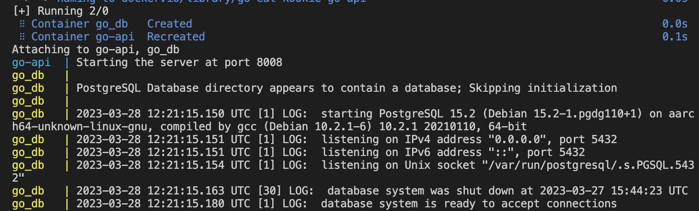
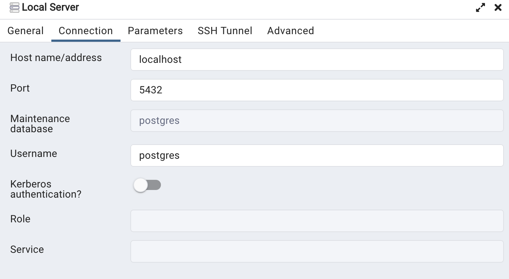
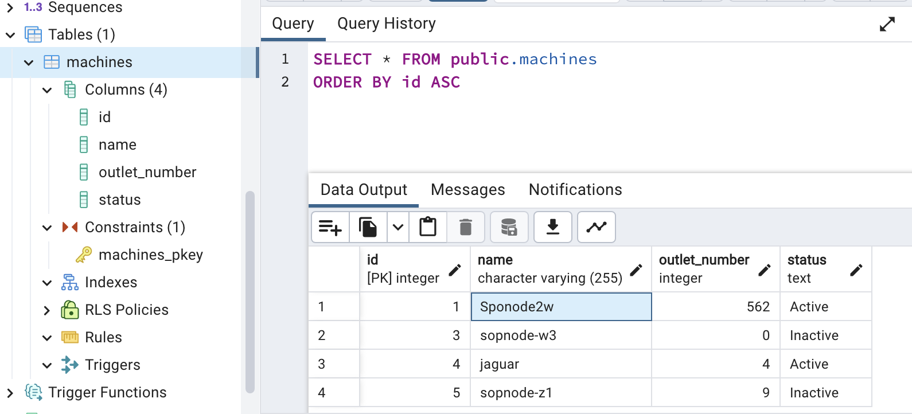

# Hands-on Tutorial: Develop REST API in Go with Mux, PostgreSQL, and Docker

This tutorial demonstrates how to build, in a containerized context, a simple REST API in Go with Gorilla Mux, PostgreSQL, and Docker. 

In this hands-on, we are following a particular user story where we have a data set of devices or machines such that each is characterized by an ID, name, number of outlets and a status. We would like to successfully retrieve, create, update or delete a machine or its associated labels.

## Why Golang (Go) for Cloud Native Applications?

[Golang](https://go.dev/) is a programming language that is purposefully designed for cloud-native development. Its fast compile times and low cognitive load make it an efficient language for developing maintainable workloads like APIs, web apps, CLI apps, networking, data processing, and cloud-native apps. 
Using less resources, Golang delivers the performance of C, the ease-of-use of Python, the garbage collection feature of Java, and native, language-level support for concurrency. Additionally, Go provides significant performance advantages over other languages (e.g. Python) because it is statistically compiled to machine code instead of being interpreted or having virtual runtimes.

## API Fondamental Concepts
In a RESTful API, each **endpoint** represents a resource that can be manipulated using HTTP methods such as GET, POST, PUT, DELETE, etc. The API is made up of a **router** that maps incoming requests to their corresponding handlers. The **handlers** on the other hand process the requests and return responses to the client.

Hence, we can define our API endpoints as follows:
- `POST /machine` to add a new device to the list
- `GET /machines` to fetch all existing machines in the list
- `GET /machines/{id}` to fetch a single device from the list using its ID
- `PUT /machines/{id}` to update an existing device
- `DELETE /machines/{id}` to delete a device from the list
## Let's Get Started 
### Prerequisites
Given that our goal is to automate this process for users to easily deploy and set up the application, you will only need:
- [Docker](https://www.docker.com/get-started/) and [Docker Compose](https://docs.docker.com/compose/install/) installed to take care of that. 
- Code editor (e.g. Visual Studio Code)
- Some basic knowledge of Go and PostgreSQL.

### Gorilla Mux Framework
If you want to create an API in Go, you want to be able to route your request not just by the path but by its HTTP method as well. [Gorilla Mux](https://www.gorillatoolkit.org/) is a great web toolkit for that matter (lightweight HTTP router for Go). It allows us to define routes and handle HTTP requests and responses in a simple and efficient way.  

For this tutorial, we are manipulating Mux since it is generally considered to be better due to its more customizable, performant, and feature-rich nature, as well as its comprehensive documentation and established community. However, you can use other frameworks like Gin-Gonic, Go-Chi and so on.

### Building our Go API
1. First, create a new project directory. Then, before we start installing all the packages, we’ll need to initialise Go Modules to manage our dependencies:
```
$ mkdir go-api && cd go-api 
```
We used a custom name for our module, though you can also set it up with your GitHub or GitLab path.

2. At this point we made it simple for you! How? We have packaged the Go application in a Docker image __k00kie/go-api__ that includes the code, Go Modules, Mux framework and Postgres library we used to build our API. Therefore, all you need to do is pull the Docker image to your new project directory:
```
$ docker pull k00kie/go-api
```
However, you can build the application manually by cloning this repository where all files and code are provided. Still you can take a look at the uploaded files in this repository to know what happens behind the scene.

3. Before starting both containers, you need to create a docker-compose.yml file to declare go-api and go-db services. As well as an SQL database file that will be mounted and loaded to Postgres.
_PS: If you have cloned the gitlab repository into your project directory (go-api), you dont need to create these two files from scratch. You will thus find them in your directory and move to the next step of running containers._

```yml
version: '3.9'

services:
  go-api:
    container_name: go-api
    image: k00kie/go-api
    environment:
      DATABASE_URL: "host=go_db user=postgres password=postgres dbname=postgres sslmode=disable"
    ports: 
      - "8008:8008"
    depends_on:
      - go_db
    
  go_db:
    container_name: go_db
    image: postgres:latest
    environment:
      POSTGRES_USER: postgres
      POSTGRES_PASSWORD: postgres
      POSTGRES_DB: postgres
    ports:
      - "5432:5432"
    volumes:
      - ./pgdata:/var/lib/postgresql/data
      - ./data.sql:/docker-entrypoint-initdb.d/data.sql

volumes:
  pgdata:
  
```  
- **Ports** is where we map the port from the container with our host computer. Our db service, for example, will be running on port 5432, which is the usual port for Postrgres.
- **Volumes**	are used to persist data generated by the service. We want to persist our db service in pgdata:/var/lib/postgresql/data.

PS: You can think of using .ENV file to store postgres credentials that we just declared directly in the configuration.

Whereas the database we used for this example in data.sql file should be located in the same directory as docker-compose.yml, which means in go-api directory following the first step.
```sql
---Creating a simple table about machines with corresponding id, name, outlet number and status

CREATE TABLE machines (
    id SERIAL PRIMARY KEY,
    name VARCHAR(255) NOT NULL,
    outlet_number INT NOT NULL,
    status TEXT
);

INSERT INTO machines (name, outlet_number, status)
VALUES
  ('sopnode-l1', 3, 'Active'),
  ('n300', 11, 'Active'),
  ('sopnode-w3', 0, 'Inactive'),
  ('jaguar', 4, 'Active'),
  ('sopnode-z1', 9, 'Inactive');
```

4. Since our backend (Go application) depends on PostgreSQL database container, we call our docker compose file to start running both services.
```
$ docker compose up
``` 
Now you should be able to see something like this:


At this point our server is listening on port 8080 and the postgres container contains our database from where we will query information.

### PgAdmin 4 Setup
[PgAdmin](https://www.pgadmin.org/) is an administrative application interface for PostgreSQL Database, you can create, design, and other database adminstrative tasks using these tools. 

We used it to check on our database and execute some queries to verify the interaction with our PostgreSQL DB. You can install the desktop version of the application.

First, open it and create a new local server with the name of your choice and configure the properties with the same parameters we used in docker compose file:

```yml
Username: postgres 
Password: postgres
```


After a successful connection to the server, you can navigate to you_local_server > Databases > Postgres > Schemas > Public > Tables in order to see and interact with the database of the tutorial.



### Testing with PostMan
The last step of this tutorial is to test our API using [PostMan](https://www.postman.com/). We will manipulate different HTTP methods like GET, POST, PUT and DELETE on the collection of endepoints we defined at the beginning of the tutorial. You can also so that in your browser to visualize the results.

Here is a simple example of GET request to list all the available machines that we have:

