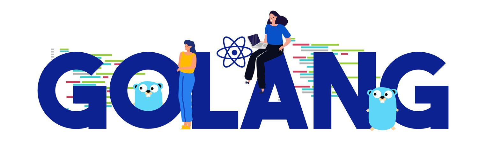

# Hands-on Tutorial: Develop REST API in Go with Mux, PostgreSQL, and Docker

This tutorial demonstrates how to build, in a containerized context, a simple REST API in Go with Gorilla Mux, PostgreSQL, and Docker. 

In this hands-on, we are following a particular user story where we have a data set of devices or machines such that each is characterized by an ID, name, number of outlets and a status. We would like to successfully retrieve, create, update or delete a machine or its associated labels.

## Why Golang (Go) for Cloud Native Applications?

[Golang](https://go.dev/) is a programming language that is purposefully designed for cloud-native development. Its fast compile times and low cognitive load make it an efficient language for developing maintainable workloads like APIs, web apps, CLI apps, networking, data processing, and cloud-native apps. 
Using less resources, Golang delivers the performance of C, the ease-of-use of Python, the garbage collection feature of Java, and native, language-level support for concurrency. Additionally, Go provides significant performance advantages over other languages (e.g. Python) because it is statistically compiled to machine code instead of being interpreted or having virtual runtimes.

## API Fondamental Concepts
In a RESTful API, each **endpoint** represents a resource that can be manipulated using HTTP methods such as GET, POST, PUT, DELETE, etc. The API is made up of a **router** that maps incoming requests to their corresponding handlers. The **handlers** on the other hand process the requests and return responses to the client.

Hence, we can define our API endpoints as follows:
- `POST /machine` to add a new device to the list
- `GET /machines` to fetch all existing machines in the list
- `GET /machines/{id}` to fetch a single device from the list using its ID
- `PUT /machines/{id}` to update an existing device
- `DELETE /machines/{id}` to delete a device from the list
## Let's Get Started 
### Prerequisites
Given that our goal is to automate this process for users to easily deploy and set up the application, you will only need:
- [Docker](https://www.docker.com/get-started/) and [Docker Compose](https://docs.docker.com/compose/install/) installed to take care of that. 
- Code editor (e.g. Visual Studio Code)
- Some basic knowledge of Go and PostgreSQL.

### Gorilla Mux Framework
If you want to create an API in Go, you want to be able to route your request not just by the path but by its HTTP method as well. [Gorilla Mux](https://www.gorillatoolkit.org/) is a great web toolkit for that matter (lightweight HTTP router for Go). It allows us to define routes and handle HTTP requests and responses in a simple and efficient way. Mux uses a concept of middleware to handle requests before they are passed to the actual route handler.  
For this tutorial, we are manipulating Mux since it is generally considered to be better due to its more customizable, performant, and feature-rich nature, as well as its comprehensive documentation and established community. However, you can use other frameworks like Gin-Gonic, Go-Chi and so on.

### Building our Go API
First, create a new project directory: 
```
$ mkdir go-api && cd go-api  
$ go mod init api
```
You will usually find Go projects using GitHub or GitLab path as module name though you can also set it up with a custom domain as the case above.